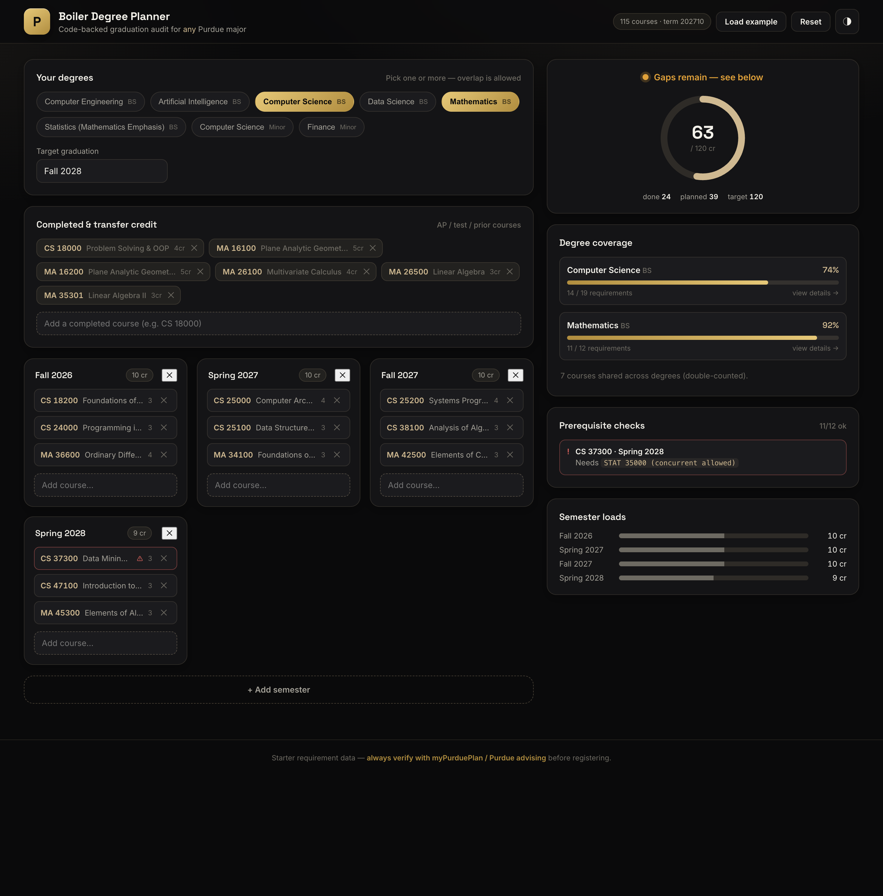
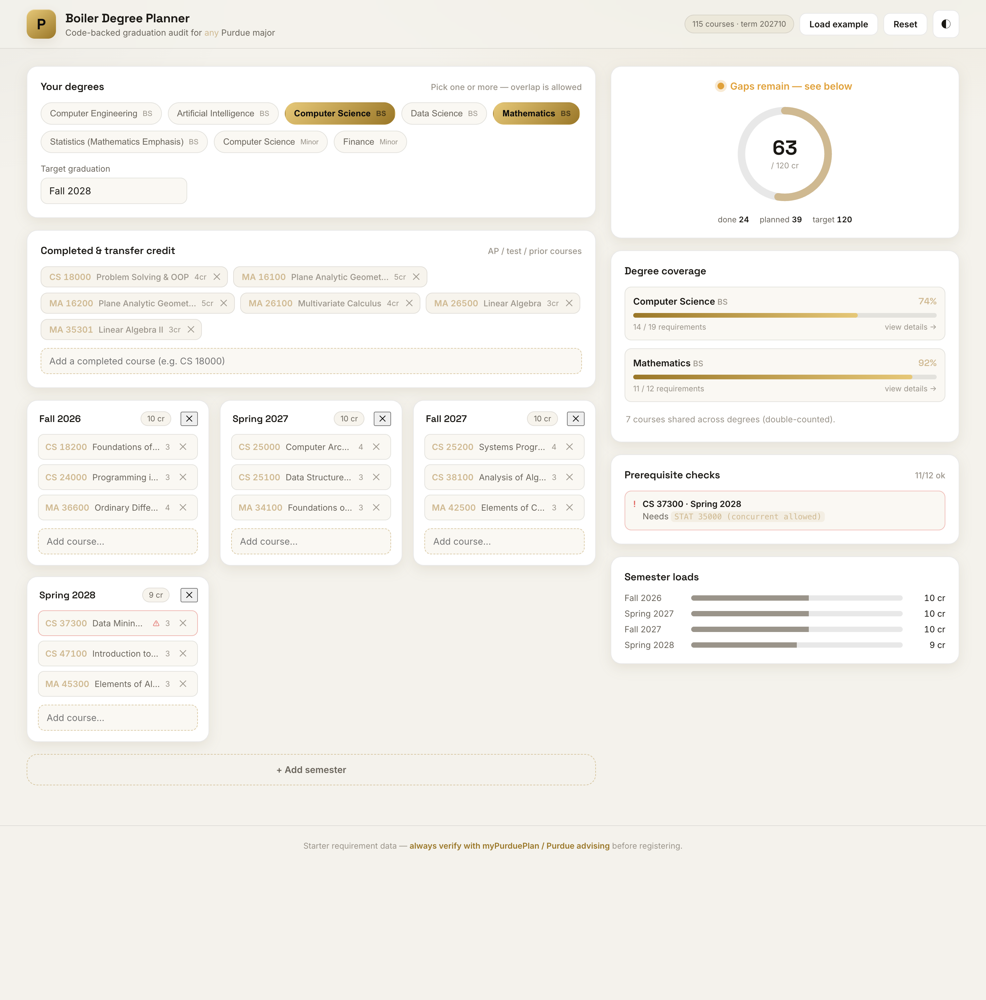
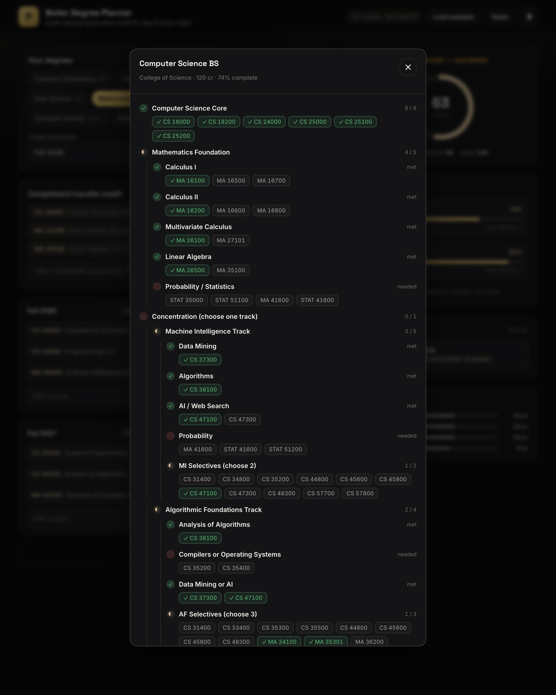

# Boiler Degree Planner

A **code-backed Purdue graduation planner**. Search **any** Purdue major and
minor (separately), and the app **auto-builds a recommended 4-year schedule** from
Purdue's official sample plan — required "core" courses placed for you, selectives
left as **fillable slots that only accept the courses actually approved for that
requirement**, and concentrations (like CS's *Algorithmic Foundations*) surfaced as
a **"pick a track" card** that expands into that track's constrained slots. The plan
**auto-arranges itself into prerequisite order on generation** — no manual fixing.
Then **drag courses between terms** and it **screams the instant a move breaks
something**: dotted lines connect prerequisites and corequisites, a backward edge
turns red, the course flags its missing prereq, and a one-click **Fix** (or **⚖
Auto-arrange** for the whole board) moves it to the earliest legal term. Live on the
side: requirement coverage, term loads, credit totals, and cross-degree overlap.

Coverage spans the **whole catalog** — a scraped index of **~960 programs** with
**~445 undergraduate majors/minors** parsed into editable requirement files.

The JSON API runs on the **Python standard library only** (`python webapp/server.py`)
and serves a prebuilt React bundle, so end users still launch it with one command.
The richer UI is a **React + TypeScript + Vite** app (`webapp/frontend/`) — rebuild
it with `npm` only when you change the frontend.



> ⚠️ The bundled requirement data is an encoded **starter**. Always verify against
> [myPurduePlan](https://www.purdue.edu/registrar/) and your academic advisor
> before registering. This repository ships **no personal academic records**.

---

## Why it's different

Most planners are spreadsheets. This one actually *understands* the rules:

- **Any major, any plan.** Each program is a declarative JSON file describing a
  tree of requirements (`all_of`, `one_of`, `choose N`, credit buckets, and
  selectable concentration tracks). Adding a new major is one JSON file — **no
  code changes**. A generic engine evaluates them all.
- **Selectives that stay honest.** A "choose 3" requirement gives you three slots,
  each restricted to the official approved list — you can't accidentally fill a
  concentration spot with an unrelated course. Concentrations are pick-a-track cards
  that expand into the right constrained slots.
- **Self-arranging plans.** Generated plans run an auto-fix pass that pushes every
  course behind its prerequisites, so the starting schedule is already legal — no
  hunting for the courses that "can't actually go there."
- **Real prerequisite logic.** Prereqs are parsed from scraped Purdue catalog
  text with full `AND`/`OR`/parentheses, Banner rule blocks, and
  concurrent-enrollment handling — then checked term-by-term against your plan.
- **On-demand scraping.** Type a course that isn't cached and the app fetches it
  live from the Purdue Self-Service catalog and remembers it.
- **Built for sharing.** Deep links (`?demo=1`, `?open=<program>`) and a
  black-and-gold / Purdue-white theme toggle make it demo-ready.

| Light theme | Requirement detail |
| --- | --- |
|  |  |

---

## Quick start (web app)

```bash
git clone https://github.com/PMN123/degree-planner.git
cd degree-planner

# The server needs nothing beyond Python 3.10+ and serves the prebuilt React
# bundle in webapp/static/dist. (requests + beautifulsoup4 enable scraping.)
pip install -r requirements.txt        # optional, enables scraping
python webapp/server.py                # -> http://127.0.0.1:8000
```

Open <http://127.0.0.1:8000>, search a major and a minor, set your start term and
any completed credit, and hit **Generate my 4-year plan**. Drag cards between terms,
fill the dashed selective/elective slots, and watch the audit react live. Your plan
auto-saves to the browser (`localStorage`) — nothing is sent anywhere.

### Deploy it live (one click)

[](https://render.com/deploy?repo=https://github.com/PMN123/degree-planner)

The repo ships a [`Dockerfile`](Dockerfile) + [`render.yaml`](render.yaml) that build
the React bundle and run the Python server, so a fresh host serves the full app. On
[Render](https://render.com)'s free tier: click the button (or **New ＋ → Web Service →**
connect this repo — the Dockerfile is auto-detected), accept the defaults, and Render
gives you a public `https://…onrender.com` URL. `$PORT` is injected automatically; no
config needed. (Free instances sleep after ~15 min idle, so the first visit waits a few
seconds while it wakes.) The same image runs on Railway, Fly.io, or any Docker host.

### Developing the frontend

The UI lives in [`webapp/frontend/`](webapp/frontend/) (React + TS + Vite). Rebuild
the served bundle after changing it:

```bash
cd webapp/frontend
npm install
npm run build          # -> ../static/dist (what python server.py serves)
# or: npm run dev      # hot-reload at :5173, proxies /api to python server on :8000
```

### Scraping programs (any major/minor)

[`scrape_programs.py`](scrape_programs.py) builds `programs_index.json` (the
searchable list) and best-effort requirement files in `webapp/programs/generated/`.
`catalog.purdue.edu` is behind AWS WAF, so a tiny headless-Chrome helper
([`scrape/waf_fetch.mjs`](scrape/waf_fetch.mjs), Playwright) mints the challenge
token once; the Python scraper reuses it.

```bash
cd scrape && npm install && cd ..        # one-time: Playwright (uses system Chrome)
python scrape_programs.py                                  # index only (~960 programs)
python scrape_programs.py --requirements --types major,minor   # + requirement trees
```

Useful URLs:

- `http://127.0.0.1:8000/?theme=light` — force light mode

---

## Adding / fixing a program (any major)

Programs load from three layers, merged by slug (later wins):

1. `programs_index.json` — the scraped searchable list (lightweight).
2. [`webapp/programs/generated/`](webapp/programs/generated/) — best-effort scraped
   requirement trees, flagged `"verified": false` (shown as **draft** in the UI).
3. [`webapp/programs/verified/`](webapp/programs/verified/) — hand-checked files that
   **override** the generated draft for the same slug.

To correct a program, copy its `generated/<slug>.json` to `verified/<slug>.json`, fix
it, and restart the server. Shared building blocks (calculus, university core) live in
[`webapp/programs/_shared.json`](webapp/programs/_shared.json), pulled in with
`{ "$include": "name" }`.

```jsonc
{
  "id": "computer-science-bs",
  "name": "Computer Science",
  "degree": "BS",
  "type": "major",
  "college": "College of Science",
  "total_credits": 120,
  "requirements": [
    { "id": "core", "name": "CS Core", "kind": "all_of",
      "courses": ["CS 18000", "CS 18200", "CS 24000", "CS 25000", "CS 25100", "CS 25200"] },

    { "id": "track", "name": "Concentration", "kind": "track_select", "choose": 1,
      "tracks": [ /* each track is an all_of of required + choose nodes */ ] },

    { "id": "selectives", "name": "CS Selectives", "kind": "choose", "choose": 3,
      "constraints": { "max_by_subject": { "MA": 1 } },
      "options": ["CS 31400", "CS 44800", "CS 48300", "MA 35301"] },

    { "$include": "university_core_science" }
  ]
}
```

Requirement node kinds:

| `kind` | meaning |
| --- | --- |
| `all_of` | every listed course / child node is required |
| `one_of` | at least one course / child node satisfies it |
| `choose` | pick `choose` N (or `choose_credits` N) of `options`; supports `constraints.max_by_subject` |
| `credits` | accumulate `credits` from courses matching a `match` filter (or a `placeholder` bucket) |
| `track_select` | choose `choose` of `tracks` (each an `all_of`-style node) |

Starter programs included: Computer Science (BS + minor), Mathematics, Statistics
(Math Emphasis), Data Science, Artificial Intelligence, Computer Engineering, and
the Finance minor — spanning the Colleges of Science, Engineering, and the Daniels
School of Business.

---

## How it fits together

```
webapp/
├── server.py          stdlib HTTP server — JSON API + static SPA, no dependencies
├── engine.py          generic, major-agnostic requirement evaluator
├── catalog.py         catalog search / credits / prereq audit + on-demand scrape
├── programs_store.py  loads programs/*.json and resolves $include fragments
├── programs/          one JSON per major/minor  ← add majors here
└── static/            the single-page UI (index.html · styles.css · app.js)

audit_plan.py          structured prerequisite & restriction parser (reused by the web app)
scrape_courses.py      cache-aware Purdue Self-Service catalog scraper
course_catalog.json    seed scraped catalog (grows as you fetch on demand)
```

### JSON API

| Method & path | Purpose |
| --- | --- |
| `GET /api/meta` | catalog size, term, program count |
| `GET /api/programs` | list available programs |
| `GET /api/programs/{id}` | full requirement tree |
| `GET /api/courses/search?q=` | search the catalog |
| `GET /api/courses/{code}` | course detail (scrapes if missing) |
| `POST /api/courses/ensure` | `{"code": "..."}` fetch a course on demand |
| `POST /api/audit` | audit a posted plan against selected programs |

---

## Command-line tools (optional)

The original scripts still work for a file-based workflow:

```bash
pip install -r requirements.txt

# 1. scrape the catalog (cache-aware; cheap to re-run)
python scrape_courses.py

# 2. audit an example plan (ships with no personal data)
python audit_plan.py --plan examples/plan.example.yaml \
                     --completed examples/completed.example.json

# 3. export a workbook
python export_simple_plan_spreadsheet.py --plan examples/plan.example.yaml \
                     --output plan.xlsx
```

`requirements/*.json` hold the encoded rules used by the legacy `audit_plan.py`
auditor; the web app uses the newer generic schema in `webapp/programs/`.

---

## Notes & limits

- Requirement data is hand-encoded and may lag the live catalog — **verify with advising**.
- The seed catalog covers ~100 common CS/Math/Stat/Finance/Engineering courses;
  anything else is pulled on demand the first time you search for it.
- College-of-Science / university-core categories are modeled as credit
  placeholders until a real degree audit fills them in.
- Plans live only in your browser. Nothing is uploaded.

## License

[MIT](LICENSE) — built as a student project, shared for the Purdue community.
